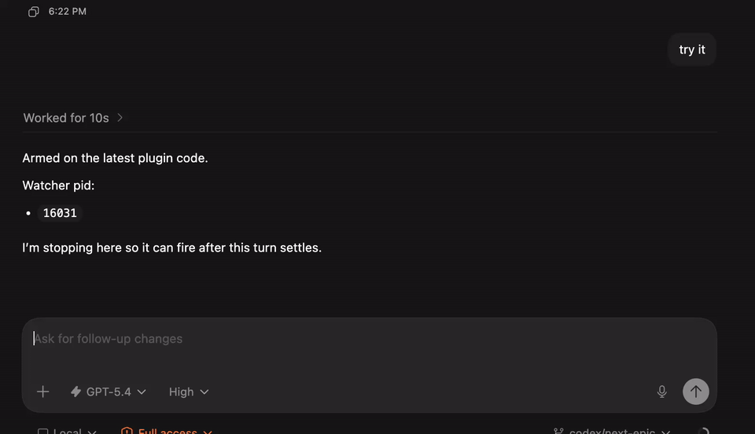

# Ralph Wiggum Codex Plugin

Ralph Wiggum Codex Plugin is a Codex-native local plugin for running bounded `codex exec` loops in the current repository.

It provides:

- `/ralph-start`
- `/ralph-status`
- `/ralph-add-context`
- `/ralph-stop`

It stores loop state under `.ralph/` in the target repository.

Demo:

[](./assets/ralph-for-codex.mov)

Default behavior:

- foreground loop in the current conversation
- optional detached mode when you pass `--background`
- if `--max-iterations` is omitted, Ralph defaults to `256` as the safety bound for “until stopped”

## Install

```bash
./scripts/install-codex-plugin.sh
```

This installer:

- symlinks the skill into `~/.codex/skills/ralph-wiggum-codex-plugin`
- symlinks the repo into `~/.codex/plugins/cache/local-codex-plugins/ralph-wiggum-codex-plugin/local`
- symlinks the repo into `~/plugins/ralph-wiggum-codex-plugin`
- enables `ralph-wiggum-codex-plugin@local-codex-plugins` in `~/.codex/config.toml`
- registers the plugin in `~/.agents/plugins/marketplace.json`

## Direct CLI Usage

```bash
node scripts/ralph-start.js --prompt "Implement feature X" --completion-promise COMPLETE
node scripts/ralph-status.js
node scripts/ralph-add-context.js --message "Prefer the smaller patch."
node scripts/ralph-stop.js
```

Visible-thread loop mode:

```bash
node scripts/ralph-start.js \
  --transport visible-thread \
  --thread-id 019d61bf-9ed1-7011-96c5-adc870674b21 \
  --prompt "continue" \
  --max-iterations 5 \
  --completion-promise COMPLETE
```

In `visible-thread` mode, Ralph:

- submits exactly one live user turn into the target Codex desktop thread
- waits for that specific turn to become terminal and then for the conversation to stay idle before attempting another iteration
- refuses to enqueue a new iteration if the conversation already has an in-progress turn
- stops looping if a newer turn supersedes the Ralph-started turn before the thread settles

If you need to arm the loop from inside an already-active turn, use the post-turn watcher:

```bash
python3 scripts/ralph-arm-visible-thread.py \
  --thread-id 019d61bf-9ed1-7011-96c5-adc870674b21 \
  --prompt "continue" \
  --max-iterations 5 \
  --iteration-timeout-ms 300000 \
  --completion-promise COMPLETE
```

That watcher waits for the current latest turn to settle first. If a newer turn supersedes it before the thread goes idle, it exits without injecting the next Ralph turn.

## Validation

```bash
./scripts/test.sh
```

## App-native loop transport

The repo now carries a first app-native loop transport seam under `local/`.

Current first-slice behavior:

- queue one prompt for a target Codex thread with `queue_prompt_for_thread`
- consume that queued prompt exactly once with `consume_queued_prompt`
- combine prompt queueing, experimental resume staging, and optional app restart with `resume_thread_with_queue`

This intentionally avoids mutating Codex session transcript files directly. The queued prompt is stored in plugin-owned local state and is meant to be consumed by a future session-start hook or app integration point when the target thread opens.
